# element-plus 组件库分析

## 源码下载

[element-plus 官网](https://element-plus.org/)
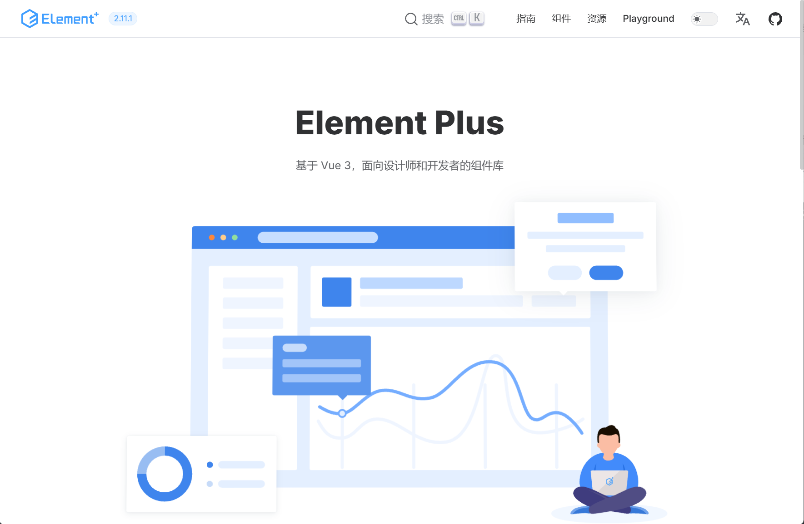
点击一下右上角Github图标
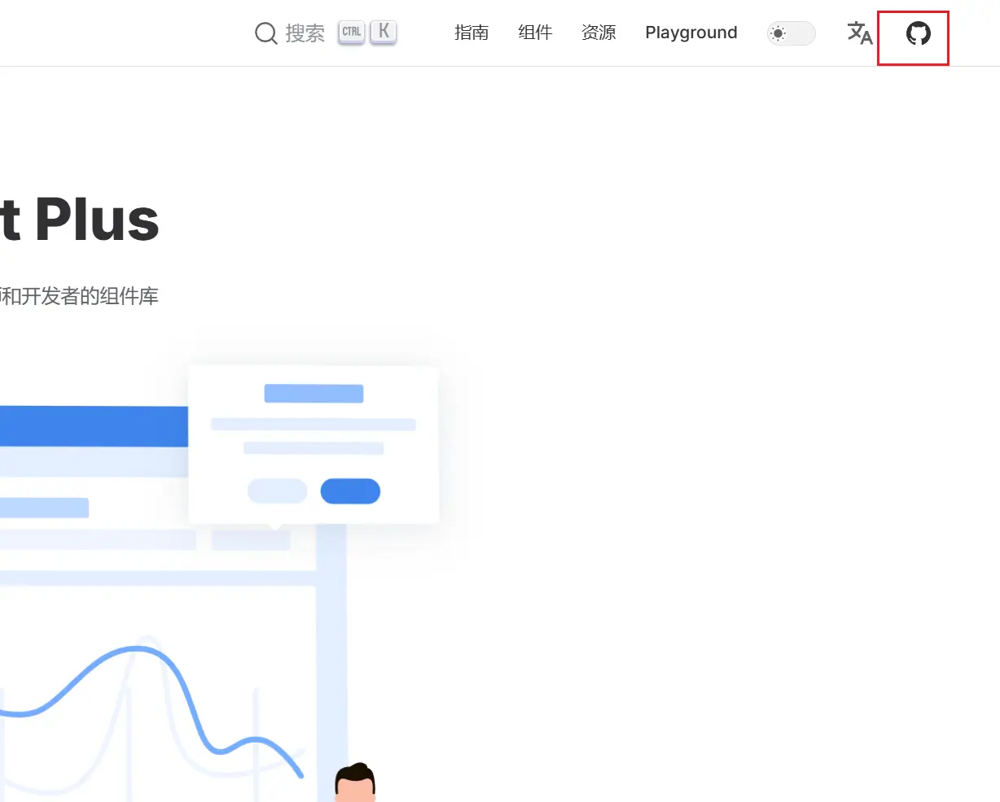
进入项目github仓库主页

[Github 仓库](https://github.com/element-plus/element-plus/tree/master)
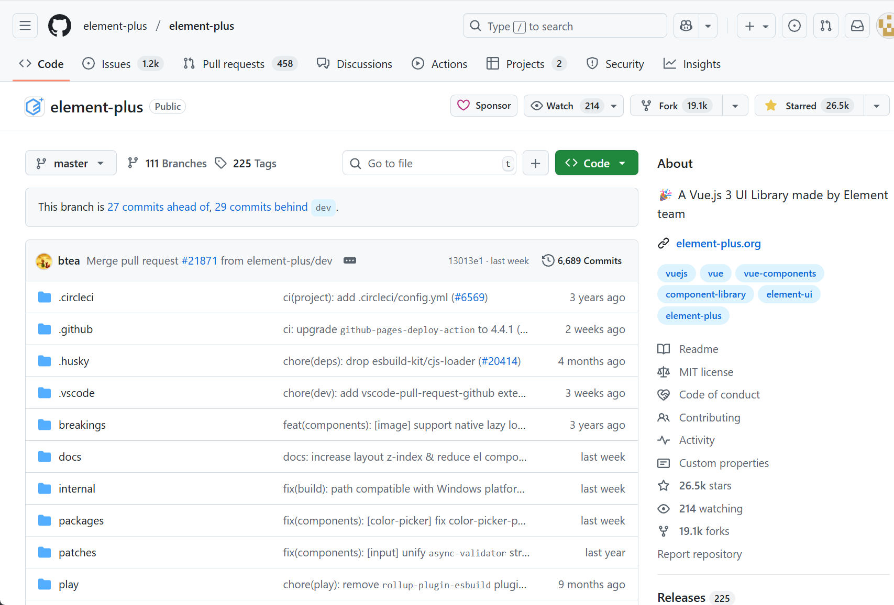

> 我们下载 master 主分支下的代码

解压下载的源码

```
  进入下载的文件夹
   cd ./element-plus-master
    安装依赖项
      pnpm install
```

### 整体目录结构

```tree
element-plus-master
├─ .circleci CI/CD配置
├─ .editorconfig 编辑器配置
├─ .env 环境变量
├─ .eslintignore  eslint 忽略
├─ .eslintrc.json eslint配置
├─ .gitattributes git配置
├─ .github  github配置
├─ .gitignore git忽略
├─ .gitpod.yml  gitpod云IDE 配置
├─ .husky 提交检验
├─ .markdownlint.json md语法检测
├─ .npmrc npm配置文件
├─ .nvmrc node版本控制
├─ .prettierignore prettier忽略
├─ .prettierrc  prettier配置
├─ .vscode  vscode编辑器配置
├─ breakings Git变更
├─ CHANGELOG.en-US.md 更改日志
├─ codecov.yml  自动化测试
├─ CODEOWNERS GitHub相关配置
├─ CODE_OF_CONDUCT.md 行为准则
├─ commitlint.config.mjs 约束提交信息
├─ CONTRIBUTING.md 贡献指南
├─ docs 文档
├─ internal element-plus 内部工具
├─ LICENSE  许可证
├─ node_modules node依赖项
├─ package.json 包声明和依赖
├─ packages monorepo工作区
├─ patches 补丁文件
├─ play 演练场
├─ pnpm-lock.yaml pnpm锁
├─ pnpm-workspace.yaml pnpm工作区声明
├─ README.md  项目介绍
├─ scripts 命令脚本
├─ ssr-testing  ssr测试
├─ tsconfig.base.json TS配置
├─ tsconfig.json TS配置
├─ tsconfig.node.json node环境下的TS配置
├─ tsconfig.play.json 演练场的TS配置
├─ tsconfig.vite-config.json  vite配置的TS配置
├─ tsconfig.vitest.json vitest单元测试的配置工具
├─ tsconfig.web.json  编译成WEB时的TS配置
├─ typings 类型声明
├─ vitest.config.mts Vitest相关
├─ vitest.setup.tsVitest相关
└─ vitest.workspace.tsVitest相关
```

我们这里可以把整个目录分为四个部分

```
1.工程化配置
  .circleci
  .editorconfig
  .env
  .eslintignore
  .eslintrc.json
  .gitattributes
  .github
  .gitignore
  .husky
  .npmrc
  .nvmrc
  .prettierignore
  .prettierrc
  .vscode
  breakings
  codecov.yml
  CODEOWNERS
  commitlint.config.mjs
  LICENSE
  node_modules
  package.json
  patches
  pnpm-lock.yaml
  pnpm-workspace.yaml
  ssr-testing
  tsconfig.base.json
  tsconfig.json
  tsconfig.node.json
  tsconfig.play.json
  tsconfig.vite-config.json
  tsconfig.vitest.json
  tsconfig.web.json
  typings
  vitest.config.mts
  vitest.setup.ts
  vitest.workspace.ts
2.组件库本身
  packages
3.辅助工具和cli脚本
  play
  .markdownlint.json
  internal
  scripts
4.文档
  CHANGELOG.en-US.md
  CODE_OF_CONDUCT.md
  CONTRIBUTING.md
  docs
  README.md
```

看着文件很多，其实很多文件是跟开源相关跟组件库本身关联不大因为他们是跟 Git 或者单元测试或者团队协作开发相关的

<font color=red> 主要看一下 packages</font>

```
packages
        ├─ components 组件
        ├─ constants  常量定义
        ├─ directives 相关的Vue指令
        ├─ element-plus 统一出口
        ├─ hooks 复用的钩子
        ├─ locale i18n
        ├─ test-utils utils的测试
        ├─ theme-chalk 颜色主题
        └─ utils 通用工具
```
### 样式系统

我们来看一下 element-plus 的样式系统
element-plus 他的样式并不是直接写在组件里的
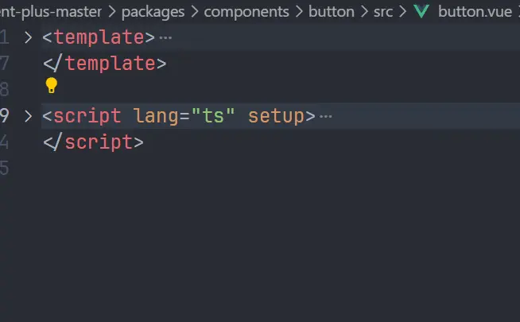
而是另外用了 theme-chalk 来存放所有组件的样式
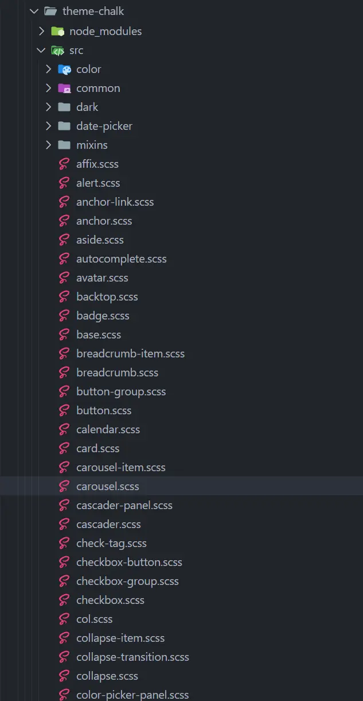
打包时候再把对应的样式注入进去

```
├─ affix.scss
├─ alert.scss
├─ anchor-link.scss
├─ anchor.scss
├─ aside.scss
├─ autocomplete.scss
├─ avatar.scss
├─ backtop.scss
├─ badge.scss
├─ base.scss
├─ breadcrumb-item.scss
├─ breadcrumb.scss
├─ button-group.scss
├─ button.scss
├─ calendar.scss
├─ card.scss
├─ carousel-item.scss
├─ carousel.scss
├─ cascader-panel.scss
├─ cascader.scss
├─ check-tag.scss
├─ checkbox-button.scss
├─ checkbox-group.scss
├─ checkbox.scss
├─ col.scss
├─ collapse-item.scss
├─ collapse-transition.scss
├─ collapse.scss
├─ color 颜色转换处理函数
├─ color-picker-panel.scss
├─ color-picker.scss
├─ common 存放颜色变量、过渡动画、弹出层
├─ config-provider.scss
├─ container.scss
├─ dark 暗色模式下的变量
├─ date-picker 日期选择器
├─ date-picker-panel.scss
├─ date-picker.scss
├─ descriptions-item.scss
├─ descriptions.scss
├─ dialog.scss
├─ display.scss
├─ divider.scss
├─ drawer.scss
├─ dropdown-item.scss
├─ dropdown-menu.scss
├─ dropdown.scss
├─ empty.scss
├─ footer.scss
├─ form-item.scss
├─ form.scss
├─ header.scss
├─ icon.scss
├─ image-viewer.scss
├─ image.scss
├─ index.scss
├─ infinite-scroll.scss
├─ input-number.scss
├─ input-tag.scss
├─ input.scss
├─ link.scss
├─ loading.scss
├─ main.scss
├─ mention.scss
├─ menu-item-group.scss
├─ menu-item.scss
├─ menu.scss
├─ message-box.scss
├─ message.scss
├─ mixins
├─ notification.scss
├─ option-group.scss
├─ option.scss
├─ overlay.scss
├─ page-header.scss
├─ pagination.scss
├─ popconfirm.scss
├─ popover.scss
├─ popper.scss
├─ progress.scss
├─ radio-button.scss
├─ radio-group.scss
├─ radio.scss
├─ rate.scss
├─ reset.scss
├─ result.scss
├─ row.scss
├─ scrollbar.scss
├─ segmented.scss
├─ select-dropdown-v2.scss
├─ select-dropdown.scss
├─ select-v2.scss
├─ select.scss
├─ skeleton-item.scss
├─ skeleton.scss
├─ slider.scss
├─ space.scss
├─ spinner.scss
├─ splitter-panel.scss
├─ splitter.scss
├─ statistic.scss
├─ step.scss
├─ steps.scss
├─ sub-menu.scss
├─ switch.scss
├─ tab-pane.scss
├─ table-column.scss
├─ table-v2.scss
├─ table.scss
├─ tabs.scss
├─ tag.scss
├─ text.scss
├─ time-picker.scss
├─ time-select.scss
├─ timeline-item.scss
├─ timeline.scss
├─ tooltip-v2.scss
├─ tooltip.scss
├─ tour.scss
├─ transfer.scss
├─ tree-select.scss
├─ tree.scss
├─ upload.scss
├─ var.scss
└─ virtual-list.scss
```

### 测试
我们找一个比较有代表性的 button 组件

````

我们把依赖安装一下

```
pnpm install
````

创建一个测试项目

```
 pnpm create vite
```

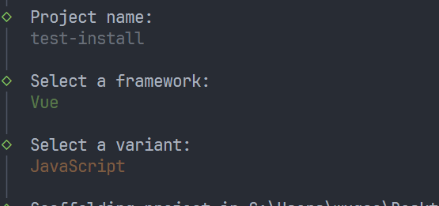

我们去引入 button 组件
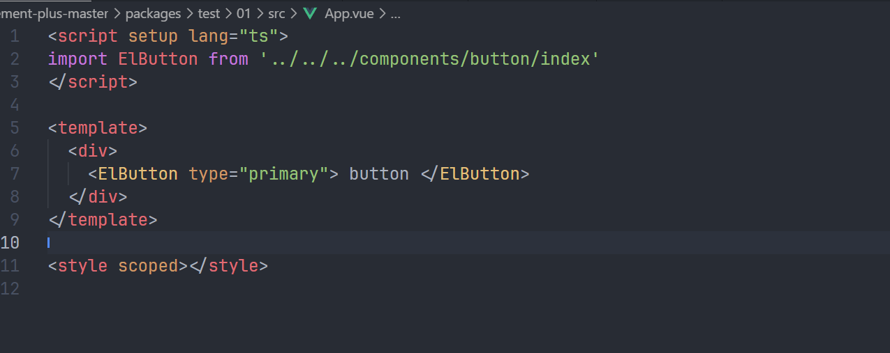
运行项目

```
pnpm run dev
```

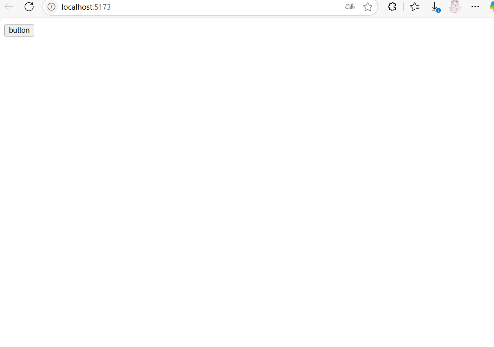
组件是正常可以加载出来的,样式竟然不生效

打开 F12 调试面板选择一下 button 组件上面是由 class 类名的
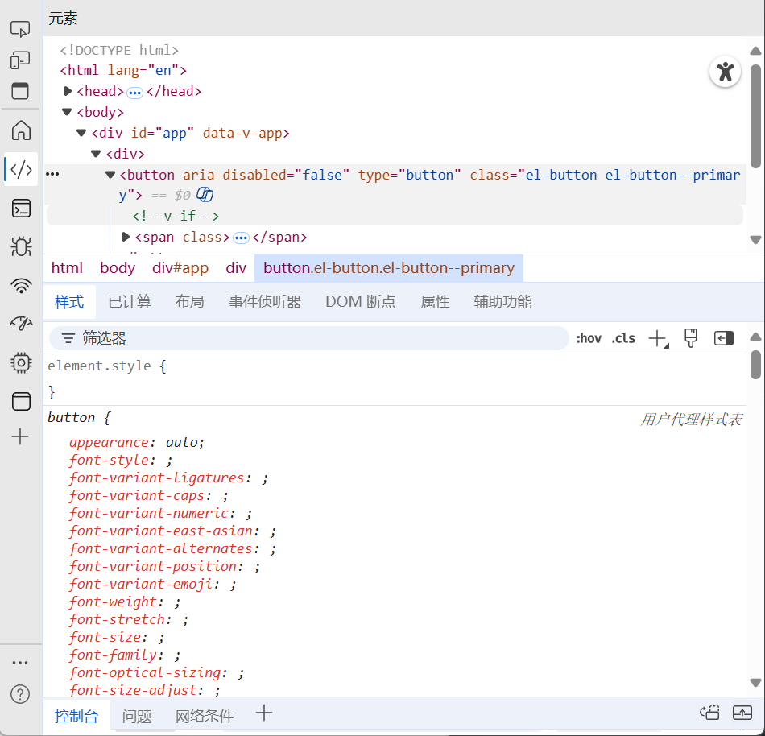
说明 vite 没有把样式依赖打包进入

我们手动引入一下 button 的组件样式
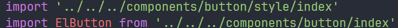
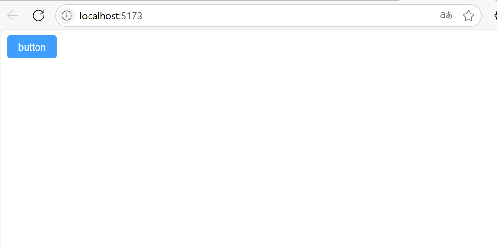
现在样式能正常加载了我们测试一下 emit 事件

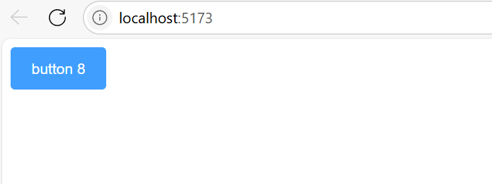
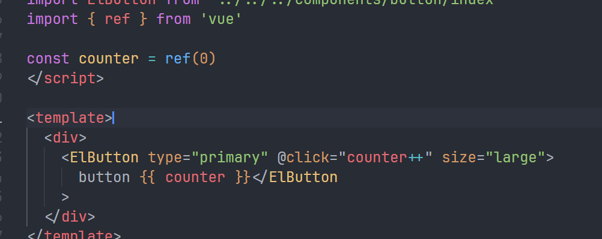
没问题样式和事件都能加载出来,说明我们引入操作没问题，到这里有细心的朋友就会问了插槽不用测试吗?其实插槽已经测试过了我们直接往 Elbutton 里写入内容就是走的插槽
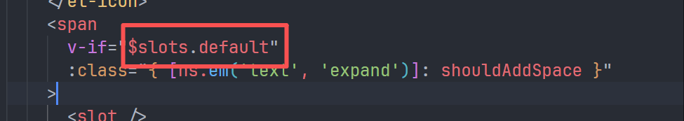
